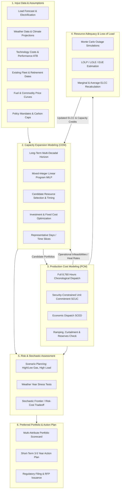

# Integrated Resource Planning (`irp`)

[](LICENSE)
[](https://www.python.org/)
[](#)

> **`irp`** is an open-source, modular capacity expansion and techno-economic optimization framework designed for modern electricity grid planning.

---

## Table of Contents

1. [Executive Summary: What is an IRP?](#1-executive-summary-what-is-an-irp)
   - [The Core Philosophy: Level Playing Field](#the-core-philosophy-level-playing-field)
   - [Why IRP is Critical in the Modern Era](#why-irp-is-critical-in-the-modern-era)
   - [The Regulatory & Stakeholder Context](#the-regulatory--stakeholder-context)
2. [The Core Pillars: The Energy Trilemma & Beyond](#2-the-core-pillars-the-energy-trilemma--beyond)
   - [Reliability & Resource Adequacy](#reliability--resource-adequacy)
   - [Affordability & Economic Efficiency](#affordability--economic-efficiency)
   - [Decarbonization & Policy Compliance](#decarbonization--policy-compliance)
   - [Resilience & Environmental Justice](#resilience--environmental-justice)
3. [The End-to-End IRP Process & Workflow](#3-the-end-to-end-irp-process--workflow)
   - [Architecture Diagram](#architecture-diagram)
   - [Step 1: Load & Peak Demand Forecasting](#step-1-load--peak-demand-forecasting)
   - [Step 2: Fleet Characterization & Retirement Schedule](#step-2-fleet-characterization--retirement-schedule)
   - [Step 3: Candidate Supply & Storage Technologies](#step-3-candidate-supply--storage-technologies)
   - [Step 4: Demand-Side Resources & Distributed Energy](#step-4-demand-side-resources--distributed-energy)
   - [Step 5: Transmission & Interconnection Assessment](#step-5-transmission--interconnection-assessment)
   - [Step 6: Capacity Expansion Modeling (CEM)](#step-6-capacity-expansion-modeling-cem)
   - [Step 7: Production Cost Modeling (PCM) & Dispatch Validation](#step-7-production-cost-modeling-pcm--dispatch-validation)
   - [Step 8: Risk, Scenario & Stochastic Stress Testing](#step-8-risk-scenario--stochastic-stress-testing)
   - [Step 9: Preferred Portfolio Selection & Action Plan](#step-9-preferred-portfolio-selection--action-plan)
4. [Mathematical & Optimization Formulations](#4-mathematical--optimization-formulations)
   - [Capacity Expansion Problem Formulation](#capacity-expansion-problem-formulation)
   - [Objective Function: Minimizing NPVRR](#objective-function-minimizing-npvrr)
   - [System-Level Constraints](#system-level-constraints)
   - [Storage Dynamics & Degradation](#storage-dynamics--degradation)
   - [Resource Adequacy & Effective Load Carrying Capability (ELCC)](#resource-adequacy--effective-load-carrying-capability-elcc)
5. [Modern Challenges in 21st-Century Grid Planning](#5-modern-challenges-in-21st-century-grid-planning)
   - [The Duck Curve and Net-Peak Shifting](#the-duck-curve-and-net-peak-shifting)
   - [Multi-Day "Dunkelflaute" & Seasonal Mismatch](#multi-day-dunkelflaute--seasonal-mismatch)
   - [Hyper-Scale Load Surges (AI, Data Centers, Electrification)](#hyper-scale-load-surges-ai-data-centers-electrification)
   - [Interconnection Queue Congestion (FERC Order 2023)](#interconnection-queue-congestion-ferc-order-2023)
   - [Climate Non-Stationarity & Compound Weather Extremes](#climate-non-stationarity--compound-weather-extremes)
6. [Landscape of Existing Tools & Software](#6-landscape-of-existing-tools--software)
   - [Commercial vs. Open-Source Comparison](#commercial-vs-open-source-comparison)
   - [Capability Matrix](#capability-matrix)
7. [The `irp` Framework Vision & Architecture](#7-the-irp-framework-vision--architecture)
   - [Design Principles](#design-principles)
   - [Modular Engine Layout](#modular-engine-layout)
   - [Development Roadmap](#development-roadmap)
8. [Glossary of Key Terms & Acronyms](#8-glossary-of-key-terms--acronyms)
9. [Key References & Further Reading](#9-key-references--further-reading)

---

## 1. Executive Summary: What is an IRP?

An **Integrated Resource Plan (IRP)** is a long-term (typically 10 to 30 years) strategic roadmap developed by electric utilities, regional transmission operators (RTOs/ISOs), and power planners to forecast future electricity demand and determine the optimal mix of supply-side generation, energy storage, transmission infrastructure, and demand-side solutions required to meet that demand.

```
                  ┌──────────────────────────────────────────────┐
                  │          FUTURE ELECTRICITY DEMAND           │
                  │   (Growth, Electrification, Extreme Weather) │
                  └──────────────────────┬───────────────────────┘
                                         ▼
┌─────────────────────────────────────────────────────────────────────────────────┐
│                    INTEGRATED RESOURCE PLANNING (IRP)                           │
│        Least-Cost, Risk-Managed, Clean, Reliable Optimization Engine             │
└────────┬───────────────────────────────┬───────────────────────────────┬────────┘
         │                               │                               │
         ▼                               ▼                               ▼
┌─────────────────┐             ┌─────────────────┐             ┌─────────────────┐
│   SUPPLY-SIDE   │             │   DEMAND-SIDE   │             │  TRANSMISSION   │
│ • Solar PV      │             │ • Energy        │             │ • Inter-zonal   │
│ • Wind (On/Off) │             │   Efficiency    │             │   Transfers     │
│ • BESS / LDES   │             │ • Demand        │             │ • Congestion    │
│ • Clean Firm    │             │   Response      │             │   Relief        │
│   (Geo, Nuclear)│             │ • Distributed   │             │ • Substation    │
│ • Thermal/Peaker│             │   PV + Storage  │             │   Upgrades      │
└─────────────────┘             └─────────────────┘             └─────────────────┘
```

### The Core Philosophy: Level Playing Field

Historically, traditional utility planning operated under a "predict-and-build" centralized paradigm: utilities estimated future load and automatically constructed centralized coal, gas, or nuclear plants to meet it. 

The breakthrough of **Integrated** Resource Planning—born out of the 1970s energy crises and formal regulatory policy like the **Public Utility Regulatory Policies Act (PURPA) of 1978**—was the realization that **saving a kilowatt-hour through demand management is economically and functionally equivalent to generating a kilowatt-hour from a power plant**. 

An IRP integrates:
1. **Supply-side options**: Centralized power generation (renewables, thermal, nuclear, hydro) and utility-scale energy storage.
2. **Demand-side options**: Energy efficiency (EE), demand response (DR), time-of-use tariffs, behind-the-meter storage, and Virtual Power Plants (VPPs).
3. **Delivery constraints**: Regional transmission import/export capabilities, intertie limits, and distribution grid hosting capacities.

All options compete on a **transparent, least-cost, risk-adjusted, and levelized economic playing field**.

### Why IRP is Critical in the Modern Era

Today, electric power grids face their most consequential paradigm shift in over a century:

| Historic Era (1980–2010) | Modern Grid Transition (2020+) |
| :--- | :--- |
| **Predictable, slow load growth** (~1–2% annually). | **Hyper-growth & load spikes** driven by AI data centers, industrial onshoring, heat pumps, and electric vehicles (EVs). |
| **Dispatchable, high-inertia thermal generation** (coal, gas, nuclear). | **Inverter-based, weather-dependent variable generation** (wind, solar) with near-zero marginal cost. |
| **Predictable seasonal gross peaks** (summer afternoon air conditioning). | **Net-load peaks shifted to evening hours** ("duck curve"), rapid multi-GW ramping, and winter heating peaks. |
| **Stationary, historical climate assumptions** (planning against historical 30-year weather). | **Compounded climate volatility** (polar vortexes, severe heat domes, simultaneous regional wind droughts). |
| **Unidirectional power flow** (generator $\rightarrow$ transmission $\rightarrow$ distribution $\rightarrow$ customer). | **Bi-directional dynamic power flow** with millions of active distributed energy resources (DERs). |

### The Regulatory & Stakeholder Context

In regulated wholesale jurisdictions (e.g., the US Southeast, Pacific Northwest, and Rocky Mountain regions), state **Public Utility Commissions (PUCs)** or **Public Service Commissions (PSCs)** require regulated investor-owned utilities (IOUs) to file an IRP every 2 to 3 years. 

The IRP filing is scrutinized through extensive public dockets involving:
- **Ratepayer Consumer Advocates**: Guarding against bill inflation and excessive capital expenditures.
- **Environmental & Clean Energy Coalitions**: Enforcing decarbonization timelines, environmental justice, and emissions compliance.
- **Independent Power Producers (IPPs) & Developers**: Ensuring fair non-discriminatory procurement opportunities.
- **Industrial Customers**: Demanding firm, uninterruptible power at competitive commercial rates.

Upon Commission acknowledgment or approval, the IRP establishes the justification for issuing **Requests for Proposals (RFPs)**, capital investments, and securing a **Certificate of Public Convenience and Necessity (CPCN)** to construct new assets.

---

## 2. The Core Pillars: The Energy Trilemma & Beyond

Modern IRP balances four overarching objectives:

```
                          [ Reliability ]
                         /               \
                        /                 \
                       /                   \
        [ Affordability ] ───────────────── [ Sustainability ]
                        \                 /
                         \               /
                          [ Resilience & ]
                          [    Equity    ]
```

### Reliability & Resource Adequacy

Reliability requires that the bulk electric system maintains balance across all operating conditions and withstands unexpected equipment outages.

- **Planning Reserve Margin (PRM)**: The percentage of surplus accredited capacity above forecasted peak load required to cover unforeseen demand surges and forced generator outages:
  $$\text{PRM} = \frac{\text{Total Accredited Firm Capacity} - \text{Peak Demand}}{\text{Peak Demand}} \times 100\%$$
  Typical utility targets range from **15% to 25%**, expanding higher in regions with high renewable penetration.
- **Loss of Load Expectation (LOLE)**: The expected number of days per year (or hours per year) in which system demand exceeds available generating capacity. The historical industry gold standard is **"1 day in 10 years"** (or **0.1 days/year**).
- **Loss of Load Hours (LOLH)**: The total expected hours of unserved energy across a planning year.
- **Expected Unserved Energy (EUE)**: The expected volume of energy (MWh) that cannot be delivered to customers, often evaluated against the **Value of Lost Load (VoLL)**, typically monetized between \$5,000/MWh and \$50,000/MWh.
- **Effective Load Carrying Capability (ELCC)**: The measure of a resource's ability to reliably replace firm, fully-dispatchable thermal capacity without degrading system reliability (detailed in [Section 4](#resource-adequacy--effective-load-carrying-capability-elcc)).

### Affordability & Economic Efficiency

The fundamental economic goal of an IRP is minimizing the **Net Present Value of Revenue Requirement (NPVRR)** or **Total System Cost** over the entire planning horizon:
- **Capital Expenditures (CapEx)**: Overnight capital costs, financing fees, debt service, return on equity (weighted average cost of capital, WACC), and grid interconnection costs.
- **Fixed Operations & Maintenance (FOM)**: Annualized recurring upkeep costs (\$/kW-yr) independent of plant utilization.
- **Variable Operations & Maintenance (VOM)**: Non-fuel costs incurred per unit of energy produced (\$/MWh).
- **Fuel Costs**: Long-term commodity forecasting (Henry Hub natural gas, coal, uranium, hydrogen).
- **Emissions Costs & Penalties**: Explicit carbon taxes or shadow prices of greenhouse gas emissions constraints.
- **Avoided Costs**: Savings generated when demand-side efficiency or storage prevents the construction of expensive peaker plants or transmission upgrades.

### Decarbonization & Policy Compliance

IRP models enforce federal, state, and corporate clean energy standards:
- **Renewable Portfolio Standards (RPS)**: Statutorily mandated quotas for renewable energy generation (e.g., 50% by 2030).
- **Clean Energy Standards (CES)**: Technology-neutral zero-carbon mandates (e.g., 100% clean electricity by 2040, including nuclear and carbon capture).
- **Emissions Caps**: Hard constraints limiting total annual metric tons of $\text{CO}_2\text{e}$.
- **Hourly 24/7 Clean Energy Matching**: Next-generation procurement frameworks requiring that every hour of local consumption is directly matched with contemporaneous zero-carbon generation.

### Resilience & Environmental Justice

Modern regulatory frameworks (e.g., California SB 100, Washington CETA, Oregon HB 2021) embed equity and climate resilience into the IRP scoring matrix:
- **Environmental Justice (EJ)**: Prioritizing the early retirement of polluting thermal peaker plants located in historically disadvantaged communities (DACs) and monitoring local criteria pollutants ($\text{NO}_x$, $\text{SO}_2$, particulate matter $\text{PM}_{2.5}$).
- **Energy Burden**: Analyzing how portfolio investments affect the monthly utility bills of low- and moderate-income (LMI) households.
- **Extreme Weather Hardening**: Modeling performance under compound tail events such as deep freezes (icing of wind turbines, gas wellhead freeze-offs, extreme heating demand) and prolonged regional heatwaves with low hydro flows.

---

## 3. The End-to-End IRP Process & Workflow

### Architecture Diagram

The IRP process is an iterative, multi-stage analytical loop connecting macroeconomic forecasts, techno-economic databases, mixed-integer optimization, and chronological physical grid simulations:



---

### Step 1: Load & Peak Demand Forecasting

The planning process begins with a multi-decade forecast of hourly electricity consumption across customer classes:
- **Baseline Econometric Drivers**: Population growth, GDP, manufacturing output, and household formation.
- **Electrification Trajectories**:
  - **Light, Medium, and Heavy-Duty Electric Vehicles (EVs)**: Charging shapes, managed charging vs. unmanaged peak charging.
  - **Building Electrification**: Air-source and ground-source heat pumps driving winter peak creation in historically summer-peaking territories.
  - **Industrial Decarbonization**: Electric arc furnaces, green hydrogen electrolysis, and process heat.
- **High-Density Hyperscale Loads**: Multi-gigawatt data centers and AI cluster workloads requiring flat 24/7 high-load-factor power.
- **Weather Normalization**: Modeling demand under Typical Meteorological Year (TMY) and Extreme Weather Meteorological Year (XMY) scenarios.

### Step 2: Fleet Characterization & Retirement Schedule

A comprehensive audit of all existing generation assets in the utility's footprint:
- Nameplate capacity, net dependable capacity, and heat rate curves (MMBtu/MWh).
- Environmental regulatory deadlines (e.g., EPA Effluent Limitations Guidelines, Coal Combustion Residuals rules, Good Neighbor Clean Air rules).
- Depreciation schedules, remaining book value, and decommissioning costs.
- Scheduled economic retirements vs. required life extensions or fuel conversions (e.g., coal-to-gas, gas-to-hydrogen).

### Step 3: Candidate Supply & Storage Technologies

Planners assemble an engineering cost-and-performance catalog for potential candidate technologies (frequently drawing from the [NREL Annual Technology Baseline (ATB)](https://atb.nrel.gov/)):

| Technology Class | Duration / Capacity Factor | Overnight CapEx (\$/kW) | Fixed O&M (\$/kW-yr) | Technical Lifetime | Round-Trip Efficiency (RTE) |
| :--- | :--- | :--- | :--- | :--- | :--- |
| **Utility-Scale Solar PV** | CF: 22% – 32% | \$900 – \$1,200 | \$15 – \$20 | 30 yrs | N/A |
| **Onshore Wind** | CF: 35% – 48% | \$1,200 – \$1,600 | \$25 – \$35 | 30 yrs | N/A |
| **Offshore Wind (Fixed/Float)** | CF: 45% – 55% | \$2,800 – \$4,500 | \$70 – \$110 | 25–30 yrs | N/A |
| **Lithium-Ion BESS (4-Hour)** | 4 hours | \$1,100 – \$1,500 | \$20 – \$30 | 15–20 yrs | 85% – 88% |
| **Lithium-Ion BESS (8-Hour)** | 8 hours | \$1,800 – \$2,400 | \$30 – \$45 | 15–20 yrs | 83% – 86% |
| **Iron-Air / Flow LDES** | 24 – 100 hours | \$1,500 – \$2,200 | \$20 – \$35 | 25–30 yrs | 45% – 70% |
| **Pumped Storage Hydro (PSH)**| 8 – 24 hours | \$2,500 – \$4,000 | \$15 – \$25 | 50+ yrs | 75% – 82% |
| **Advanced Nuclear (SMR)** | CF: 90% – 95% | \$6,000 – \$10,000 | \$100 – \$150 | 60 yrs | N/A |
| **Combined Cycle Gas (CCGT)** | CF: 60% – 85% | \$1,100 – \$1,400 | \$12 – \$18 | 35 yrs | Heat Rate: ~6.4 MMBtu/MWh |
| **Aeroderivative Gas Peaker** | CF: 5% – 15% | \$900 – \$1,200 | \$10 – \$15 | 35 yrs | Heat Rate: ~9.5 MMBtu/MWh |
| **Geothermal (Next-Gen EGS)**| CF: 90% – 95% | \$4,500 – \$6,500 | \$80 – \$120 | 35 yrs | N/A |

### Step 4: Demand-Side Resources & Distributed Energy

Demand-side options are bundled into discrete tranches:
- **Energy Efficiency (EE)**: LED lighting, building envelope upgrades, high-efficiency HVAC equipment. Characterized by "negawatt-hour" cost curves and hourly load-reduction shapes.
- **Demand Response (DR)**: Direct load control of industrial chillers, commercial thermostat setbacks, and irrigation pumps callable during peak hours.
- **Virtual Power Plants (VPPs)**: Aggregated behind-the-meter residential batteries, smart water heaters, and EV bidirectional chargers (V2G/V2H) operating under coordinated dispatch algorithms.

### Step 5: Transmission & Interconnection Assessment

Power plants cannot serve load without transfer capacity. IRP models incorporate:
- **Zonal Transfer Capabilities**: Modeling the grid as connected balancing authorities with maximum transfer limits (MW).
- **Interconnection Costs**: Substation upgrades, transmission spur lines, and network upgrade allocations based on regional interconnection tariffs (e.g., FERC Order 2023).
- **Import/Export Contracts**: Firm market purchases vs. non-firm spot market liquidity across regional interties.

### Step 6: Capacity Expansion Modeling (CEM)

The mathematical core of long-term planning. The CEM executes an optimization algorithm over a multi-decadal horizon to determine **what to build, when to build it, where to interconnect it, and what to retire**. To maintain computational tractability over 20+ years, CEM models historically sample representative chronological days (e.g., 12 to 52 representative weeks) with time-slice aggregation.

### Step 7: Production Cost Modeling (PCM) & Dispatch Validation

Candidate portfolios generated by the CEM are exported into a **Production Cost Model (PCM)**. 
- Simulates every chronological hour (all 8,760 hours of a year, or sub-hourly at 5-minute increments) across multiple historical and future weather years.
- Solves **Security-Constrained Unit Commitment (SCUC)** and **Security-Constrained Economic Dispatch (SCED)**.
- Tests operational realities: generator minimum up and down times, ramp rates, start-up and shut-down costs, spinning reserve margins, transmission thermal limits, and renewable curtailment.

### Step 8: Risk, Scenario & Stochastic Stress Testing

Because a single 30-year forecast is guaranteed to be wrong, planners subject candidate portfolios to systematic uncertainty analysis:
- **Deterministic Scenarios**: Combinations of high/low gas prices, high/low load growth, federal carbon policies, and accelerated technology cost declines.
- **Stochastic Risk Modeling**: Monte Carlo simulations running hundreds of iterations where generator outages, hydro availability, solar/wind irradiance, and ambient temperatures vary probabilistically.

### Step 9: Preferred Portfolio Selection & Action Plan

The culmination of the IRP docket:
- **Multi-Attribute Decision Analysis**: Portfolios are ranked across a scorecard evaluating Expected NPVRR, P95 Tail Risk Cost, Carbon Reduction (%), Land Use Footprint, Reliability (LOLE), and Rate Stability.
- **The Short-Term Action Plan (3 to 5 Years)**: Translates long-term goals into immediate, concrete regulatory actions: issuing RFPs for specific MW of solar, storage, and clean firm capacity; filing rate cases for grid modernization; or commissioning engineering studies for transmission upgrades.

---

## 4. Mathematical & Optimization Formulations

### Capacity Expansion Problem Formulation

The canonical Capacity Expansion Model (CEM) is formulated as a large-scale **Mixed-Integer Linear Program (MILP)** or **Linear Program (LP)**.

```
                  ┌──────────────────────────────────────────────┐
                  │              OBJECTIVE FUNCTION              │
                  │        Minimize NPVRR (Total System Cost)    │
                  └──────────────────────┬───────────────────────┘
                                         │
        ┌────────────────────────────────┼────────────────────────────────┐
        ▼                                ▼                                ▼
┌─────────────────┐             ┌─────────────────┐             ┌─────────────────┐
│ System Balance  │             │ Resource        │             │ Operating &     │
│ • Energy Demand │             │ Adequacy        │             │ Asset Dynamics  │
│ • Power Flow    │             │ • PRM           │             │ • Storage SOC   │
│ • Reserves      │             │ • Dynamic ELCC  │             │ • Ramping       │
│ • Emissions     │             │ • Loss of Load  │             │ • Min Up/Down   │
└─────────────────┘             └─────────────────┘             └─────────────────┘
```

#### Indices & Sets
- $t \in \mathcal{T}$: Planning years ($t \in \{1, 2, \dots, T\}$).
- $h \in \mathcal{H}$: Chronological hours within modeled periods ($h \in \{1, 2, \dots, H\}$).
- $z \in \mathcal{Z}$: Geographical zones or nodes.
- $r \in \mathcal{R}$: Resource candidate and existing technologies.
- $s \in \mathcal{S} \subset \mathcal{R}$: Subset of energy storage resources.
- $v \in \mathcal{V} \subset \mathcal{R}$: Subset of variable renewable energy resources (solar, wind).

#### Decision Variables
- $X_{r,z,t} \ge 0$: Newly constructed capacity of resource $r$ in zone $z$ at year $t$ [MW].
- $R_{r,z,t} \ge 0$: Retired capacity of existing resource $r$ in zone $z$ at year $t$ [MW].
- $K_{r,z,t} \ge 0$: Total active installed capacity of resource $r$ in zone $z$ at year $t$ [MW].
- $P_{r,z,t,h} \ge 0$: Generation power output of resource $r$ in zone $z$ at year $t$, hour $h$ [MW].
- $P_{s,z,t,h}^{\text{chg}} \ge 0$: Charging power of storage resource $s$ in zone $z$ at year $t$, hour $h$ [MW].
- $SOC_{s,z,t,h} \ge 0$: State of charge of storage resource $s$ at year $t$, hour $h$ [MWh].
- $F_{z,z',t,h}$: Power flow along transmission corridor between zones $z$ and $z'$ [MW].
- $U_{z,t,h} \ge 0$: Unserved demand / involuntary load shed in zone $z$ at hour $h$ [MW].
- $C_{v,z,t,h} \ge 0$: Curtailed renewable generation [MW].

---

### Objective Function: Minimizing NPVRR

The planner seeks to minimize the present value of all revenue requirements across the horizon discounted at rate $d$:

$$\min \sum_{t \in \mathcal{T}} \frac{1}{(1 + d)^t} \Big[ \text{CapEx}_t + \text{FixedOM}_t + \text{VarCost}_t + \text{PenaltyCost}_t \Big]$$

Where:

$$\text{CapEx}_t = \sum_{z \in \mathcal{Z}} \sum_{r \in \mathcal{R}} \text{CRF}_r \cdot C_{r,z,t}^{\text{inv}} \cdot X_{r,z,t}$$

- $C_{r,z,t}^{\text{inv}}$: Overnight investment cost per MW (\$/MW).
- $\text{CRF}_r = \frac{d(1+d)^{N_r}}{(1+d)^{N_r} - 1}$: Capital Recovery Factor over economic life $N_r$ with discount rate $d$.

$$\text{FixedOM}_t = \sum_{z \in \mathcal{Z}} \sum_{r \in \mathcal{R}} C_{r,z,t}^{\text{fom}} \cdot K_{r,z,t}$$

$$\text{VarCost}_t = \sum_{h \in \mathcal{H}} w_h \sum_{z \in \mathcal{Z}} \sum_{r \in \mathcal{R}} \left( C_{r,z,t}^{\text{vom}} + \frac{\text{FuelPrice}_{r,z,t}}{\eta_r} \right) P_{r,z,t,h}$$

- $w_h$: Weight factor of modeled hour $h$ representing annualized hours.
- $\eta_r$: Fuel conversion thermal efficiency (Heat Rate $= \frac{3.412}{\eta_r}$ MMBtu/MWh).

$$\text{PenaltyCost}_t = \sum_{h \in \mathcal{H}} w_h \sum_{z \in \mathcal{Z}} \text{VoLL} \cdot U_{z,t,h} + \sum_{z \in \mathcal{Z}} \text{Cost}^{\text{emiss}} \cdot \text{Emissions}_{z,t}$$

---

### System-Level Constraints

#### 1. Hourly Energy Balance & Kirchhoff's Power Flow
For every zone $z$, year $t$, and hour $h$, supply plus net imports must satisfy demand minus unserved load:

$$\sum_{r \in \mathcal{R}} P_{r,z,t,h} - \sum_{s \in \mathcal{S}} P_{s,z,t,h}^{\text{chg}} + \sum_{z' \in \mathcal{Z}} \big( F_{z',z,t,h} (1 - \lambda_{z',z}) - F_{z,z',t,h} \big) + U_{z,t,h} = D_{z,t,h}$$

- $D_{z,t,h}$: Electric load demand [MW].
- $\lambda_{z',z}$: Line loss factor along transmission corridor.

#### 2. Generator Capacity Limits & Renewable Dispatch
For thermal and hydro units:
$$0 \le P_{r,z,t,h} \le K_{r,z,t} \quad \forall r \notin \mathcal{V}$$

For variable renewables (wind and solar) subject to meteorological resource availability profile $\alpha_{v,z,t,h} \in [0, 1]$:
$$P_{v,z,t,h} + C_{v,z,t,h} = \alpha_{v,z,t,h} \cdot K_{v,z,t}$$

#### 3. Capacity Accounting & Cumulative Builds
Active capacity transitions smoothly across planning years:
$$K_{r,z,t} = K_{r,z,t-1} + X_{r,z,t} - R_{r,z,t}$$

#### 4. Emissions Caps & Clean Energy Mandates
Total annual system emissions must remain below statutory policy limits $\text{Cap}_t^{\text{CO}_2}$:
$$\sum_{h \in \mathcal{H}} w_h \sum_{z \in \mathcal{Z}} \sum_{r \in \mathcal{R}} \mu_{r}^{\text{CO}_2} \cdot P_{r,z,t,h} \le \text{Cap}_t^{\text{CO}_2}$$
- $\mu_{r}^{\text{CO}_2}$: Specific carbon emissions intensity ($\text{metric tons CO}_2/\text{MWh}$).

---

### Storage Dynamics & Degradation

Energy storage systems (batteries, pumped hydro, hydrogen) couple sequential time steps, requiring chronologically consistent state tracking:

```
        P_chg (Charge)          SOC_{h-1}
              │                     │
              ▼                     ▼
       ┌─────────────┐        ┌─────────────┐
       │   η_chg     │───────▶│ (1 - self)  │───────▶ SOC_h
       └─────────────┘        └─────────────┘
                                    │
                                    ▼
                              ┌─────────────┐
                              │  1 / η_dis  │
                              └─────────────┘
                                    │
                                    ▼
                               P_dis (Discharge)
```

#### State of Charge (SOC) Conservation
$$SOC_{s,z,t,h} = SOC_{s,z,t,h-1} \cdot (1 - \gamma_s) + \eta_s^{\text{chg}} \cdot P_{s,z,t,h}^{\text{chg}} - \frac{1}{\eta_s^{\text{dis}}} \cdot P_{s,z,t,h}$$

- $\gamma_s$: Hourly parasitic self-discharge loss rate.
- $\eta_s^{\text{chg}}, \eta_s^{\text{dis}}$: One-way charging and discharging efficiencies ($\text{RTE} = \eta_s^{\text{chg}} \times \eta_s^{\text{dis}}$).

#### Power and Energy Bounds
$$0 \le P_{s,z,t,h} \le K_{s,z,t}^{\text{power}}$$
$$0 \le P_{s,z,t,h}^{\text{chg}} \le K_{s,z,t}^{\text{power}}$$
$$SOC_{s,z,t,h} \le K_{s,z,t}^{\text{energy}} = \Delta_s \cdot K_{s,z,t}^{\text{power}}$$
- $\Delta_s$: Storage duration ratio (e.g., 4h, 8h, 24h, 100h).

#### Battery Degradation Approximation
To capture cyclic degradation in linear optimization without non-convex cycle-counting algorithms, a throughput-based cost or replacement penalty is introduced:
$$C_{s,t}^{\text{deg}} = \frac{C_{s}^{\text{cell replacement}}}{\text{CycleLife} \times 2 \cdot \Delta_s \cdot \text{DOD}} \cdot \sum_{h \in \mathcal{H}} w_h \cdot P_{s,z,t,h}$$

---

### Resource Adequacy & Effective Load Carrying Capability (ELCC)

A simple nameplate capacity comparison fails in a grid dominated by weather-dependent renewables and duration-limited storage. 100 MW of solar cannot guarantee 100 MW of power during an 8:00 PM winter freeze.

#### Planning Reserve Margin Constraint
In the CEM formulation, resource adequacy is enforced at peak load conditions:

$$\sum_{r \in \mathcal{R}} \text{ELCC}_{r,z,t} \cdot K_{r,z,t} \ge (1 + \text{PRM}_t) \cdot \text{PeakDemand}_{z,t}$$

```
Capacity Credit / ELCC (%)
100% ┌──────────────────────────────────────────────
     │  ● Clean Firm (Nuclear, Geothermal, Gas)
 80% │
 60% │       ● Wind (Winter Peaking)
 40% │             ● 4-Hr Battery Storage (Degrades with penetration)
 20% │                   ● Solar PV (Steep drop-off due to duck curve)
  0% └──────────────────────────────────────────────
     0%      10%      20%      30%      40%      50%
                   Renewable Penetration (% of Total Energy)
```

#### Defining ELCC Probabilistically
The **Effective Load Carrying Capability (ELCC)** of an incremental resource is the amount of additional firm load that the power system can supply while maintaining the exact same target reliability metric (e.g., LOLE = 0.1 days/year).

Mathematically, let $\text{LOLE}(K)$ be the loss of load expectation of benchmark system $K$. When adding capacity $\Delta K_r$ of resource $r$, the reliability improves. The ELCC is the load increment $\Delta L$ such that:

$$\text{LOLE}\big(K + \Delta K_r, \text{PeakLoad} + \Delta L\big) = \text{LOLE}(K, \text{PeakLoad})$$

$$\text{ELCC}_r (\%) = \frac{\Delta L}{\Delta K_r} \times 100\%$$

#### The Saturation Effect & Declining Marginal ELCC
As solar penetration increases, it eliminates daytime loss-of-load risk. The critical net peak shifts to late evening after sunset. Consequently, **solar marginal ELCC drops precipitously toward zero**. 

Similarly, short-duration (4-hour) batteries initially have an ELCC near 100%. However, as battery penetration deepens, the net peak broadens from a narrow 2-hour spike into a flat 8-to-12 hour plateau, causing **short-duration battery marginal ELCC to decline sharply**, increasing the need for 8h+, 24h+, or multi-day Long-Duration Energy Storage (LDES) and clean firm generation.

---

## 5. Modern Challenges in 21st-Century Grid Planning

### The Duck Curve and Net-Peak Shifting

As distributed and utility-scale solar PV expand, the middle-of-the-day net load drops, creating the infamous "California Duck Curve". In high-solar grids:
- Mid-day wholesale power prices frequently plunge negative, forcing renewable curtailment.
- As the sun sets, the system faces steep **multi-gigawatt ramps** over a 2-to-3 hour window.
- The planning peak is no longer the hour of highest gross consumer electricity consumption; it is the **hour of highest net load** ($D_{\text{net}} = \text{Gross Load} - \text{Solar} - \text{Wind}$).

```
MegaWatts (MW)
   ▲
   │        /───\ Gross Load
   │       /     \
   │  ────/       \──────/───\
   │     /  Duck   \    / Net \ ◄── Steep Evening Ramp
   │    /   Belly   \──/  Peak \
   │   /                        \
   └───────────────────────────────────▶ Time (00:00 to 24:00)
```

### Multi-Day "Dunkelflaute" & Seasonal Mismatch

"Dunkelflaute" (German for *dark doldrums*) describes a meteorological phenomenon where low wind speeds and heavy cloud cover coincide for multiple consecutive days or weeks, frequently accompanied by extreme winter cold.
- 4-hour and 8-hour lithium-ion batteries are depleted within the first evening.
- Solar output drops to 5–15% of capacity; wind capacity factors drop under 10%.
- Traditional CEM models using representative days (e.g., 24 typical days) **fail to capture multi-day inventory depletion**, severely underestimating the required clean firm capacity or long-duration storage needed to survive seasonal anomalies.

### Hyper-Scale Load Surges (AI, Data Centers, Electrification)

For decades, US electricity demand grew at a sleepy 0.5% – 1% per year. Between 2023 and 2030, load forecasts in regions like PJM, ERCOT, and the Southeast US doubled or tripled:
- **AI & Cloud Data Centers**: Individual campuses requesting 500 MW to 2,000 MW of continuous power with 99.999% reliability expectations.
- **Industrial Onshoring**: Semiconductor fabrication plants, battery gigafactories, and clean steel plants requiring massive, localized electrical infrastructure.
- **Electrified Transport & Heating**: Concurrent EV home charging and winter heat pump cycling creating acute local distribution and transmission substation bottlenecks.

### Interconnection Queue Congestion (FERC Order 2023)

In major US grid operators (PJM, MISO, ERCOT, CAISO, SPP, ISO-NE, NYISO), over **2,600 GW of generation and storage capacity** languishes in interconnection queues—more than twice the entire existing US operating generation fleet.
- Average project wait times from initial study request to commercial operation have surged from **2 years (in 2008) to over 5 years today**.
- Speculative project filings, cluster study delays, and astronomical network upgrade costs ($100M+ per connection) disrupt IRP procurement schedules.
- Planners can no longer assume that the least-cost resource selected in an optimization model can be interconnected in time to prevent reliability shortfalls.

### Climate Non-Stationarity & Compound Weather Extremes

Traditional IRP models relied on backward-looking 30-year historical weather patterns under the assumption of **climate stationarity**. 
- Modern extreme events (e.g., Winter Storm Uri in 2021, Winter Storm Elliott in 2022, historic Pacific Northwest Heat Domes) demonstrate that weather distributions are shifting.
- Correlated failure modes: extreme freezing temperatures simultaneously spike electric heating demand, freeze natural gas wellheads, trip gas turbine sensors, and ice wind turbine blades.
- Modern IRP requires **probabilistic forward-looking climate projections** (e.g., CMIP6 downscaled models) to test grid resilience.

---

## 6. Landscape of Existing Tools & Software

### Commercial vs. Open-Source Comparison

Electric grid resource planning software generally splits into proprietary enterprise suites and open-source research platforms:

```
┌─────────────────────────────────────────────────────────────────────────────────┐
│                           POWER SYSTEM PLANNING TOOLS                           │
├───────────────────────────────────────┬─────────────────────────────────────────┤
│    COMMERCIAL ENTERPRISE ENGINES      │       OPEN-SOURCE RESEARCH SUITES       │
│                                       │                                         │
│ • PLEXOS (Energy Exemplar)            │ • PyPSA (Python for Power System Analy.)│
│ • Aurora (Energy Velocity / Hitachi)  │ • GenX (MIT / Princeton)                │
│ • EnCompass (Anchor House Modeling)   │ • NREL ReEDS (Regional Energy Deploy.)  │
│ • PROMOD / PROCOS (Hitachi Energy)    │ • GridPath (Blue Marble Analytics)      │
│ • RESOLVE (Energy & Envr. Economics)  │ • Switch (UC Berkeley / Univ. Hawaii)   │
└───────────────────────────────────────┴─────────────────────────────────────────┘
```

### Capability Matrix

| Tool | Primary Purpose | Mathematical Formulation | Open Source? | Language / Solver | Strengths | Limitations |
| :--- | :--- | :--- | :--- | :--- | :--- | :--- |
| **PLEXOS** | CEM, PCM, Gas, Water | MILP, LP, QP | ❌ Proprietary | C# / Gurobi, CPLEX, Xpress | Global industry benchmark; co-optimizes power, gas, and hydro networks. | Extremely costly licenses; closed-source black box; steep learning curve. |
| **Aurora** | Capacity Expansion & PCM | Chronological Dispatch, LP | ❌ Proprietary | Proprietary / Commercial Solvers | Widely used across North American utility IRP dockets; built-in market databases. | Opaque solver heuristics; difficult custom constraint scripting. |
| **RESOLVE** | Clean Energy & IRP CEM | LP / MILP | ❌ Proprietary | Python / Commercial Solvers | Specifically designed for state clean energy policy dockets (CAISO, CPUC, Hawaii). | Focused strictly on capacity expansion; simplified zonal dispatch representation. |
| **PyPSA** | Network & Expansion | LP, SOCP, non-linear OPF | ✅ Open Source (GPLv3) | Python / HiGHS, Gurobi, Cbc | Outstanding power flow physics, transmission line modeling, and European datasets. | High memory footprint for continental 8760 multi-period solves. |
| **GenX** | Capacity Expansion | LP / MILP | ✅ Open Source (MIT) | Julia / JuMP (Gurobi, HiGHS) | Modern formulation; handles LDES, operational reserves, and multi-stage expansion. | Julia ecosystem adoption barrier for standard enterprise Python shops. |
| **GridPath** | Comprehensive Planning | LP / MILP | ✅ Open Source (Apache 2.0) | Python / Pyomo | Highly modular architecture bridging CEM, production cost, and resource adequacy. | Complex database configuration; community size and documentation depth. |
| **ReEDS** | Long-Term US Fleet Evolution | LP | ✅ Open Source (BSD) | GAMS | Authoritative NREL flagship model for long-term national decarbonization studies. | Written in proprietary GAMS language; highly complex national-scale setup. |

---

## 7. The `irp` Framework Vision & Architecture

The **`irp`** repository is designed to fill a crucial gap: providing an accessible, modular, transparent, and computationally efficient Python-first engine for Integrated Resource Planning, capacity expansion, and techno-economic evaluation.

### Design Principles

1. **Open Science & Full Reproducibility**: Clean, mathematically transparent formulations without proprietary solver black boxes or hidden heuristic "adders".
2. **Modern Pythonic Architecture**: Native integration with `pydantic` for schema validation, `polars`/`pandas` for vector operations, and `linopy`/`pyomo` for solver-agnostic mathematical modeling.
3. **Solver Neutrality**: Seamlessly dispatchable to open-source solvers ([HiGHS](https://highs.dev/), [CBC](https://github.com/coin-or/Cbc)) for barrier-free educational access, while supporting enterprise commercial solvers ([Gurobi](https://www.gurobi.com/), [CPLEX](https://www.ibm.com/products/ilog-cplex-optimization-studio), [Xpress](https://www.fico.com/en/products/fico-xpress-optimization)) for industrial dockets.
4. **Co-Optimized Storage & Degradation Physics**: First-class support for multi-duration energy storage (4h lithium-ion, 8h-12h flow batteries, 100h iron-air) with explicit state-of-charge tracking and cyclic degradation penalties.
5. **Decoupled Workflow Pipeline**: Clean interfaces separating input data ETL, capacity optimization, chronological hourly redispatch, reliability assessment, and report generation.

### Modular Engine Layout

```
irp/
├── core/
│   ├── config.py             # Global run configurations & time-horizon settings
│   ├── datamodel.py          # Strict Pydantic schemas for generators, storage, demand
│   └── units.py              # Dimensional analysis & unit conversions (MW, MWh, MMBtu)
│
├── data/
│   ├── loader.py             # Ingestion pipelines (CSV, Parquet, NetCDF weather)
│   ├── profiles.py           # Hourly 8760 solar, wind, and demand shape normalizers
│   └── atb_client.py         # Automated NREL ATB technology cost downloader
│
├── expansion/
│   ├── model.py              # Core Capacity Expansion Optimization Formulation (MILP/LP)
│   ├── constraints/
│   │   ├── balance.py        # Hourly energy balance & transmission transfer limits
│   │   ├── reserves.py       # Planning reserve margin (PRM) & operating reserves
│   │   ├── storage.py        # State of charge, round-trip efficiency, degradation
│   │   └── policy.py         # RPS mandates, emissions caps, 24/7 matching constraints
│   └── clustering.py         # Time-series aggregation (k-means representative weeks)
│
├── dispatch/
│   ├── pcm.py                # Chronological 8760-hour Security-Constrained Economic Dispatch
│   └── unit_commitment.py   # SCUC formulation with min up/down times & start costs
│
├── adequacy/
│   ├── elcc.py               # Iterative Effective Load Carrying Capability calculator
│   └── lole.py               # Monte Carlo loss-of-load & unserved energy evaluation
│
├── analytics/
│   ├── economics.py          # NPVRR calculation, LCOE/LCOS breakdowns, ratepayer bill impact
│   ├── emissions.py          # Scope 1 emissions, avoided carbon abatement costs
│   └── plots.py              # Interactive visualization suite (Duck curve, dispatch stacks)
│
└── tests/                    # Unit, integration, and mathematical benchmark test suites
```

### Development Roadmap

- [x] **Phase 0: Conceptualization & Primer**: Comprehensive domain primer, mathematical formulation, and architecture roadmap.
- [ ] **Phase 1: Minimal Viable Planner (MVP)**: Single-zone linear capacity expansion model with representative days, solar, wind, gas, battery storage, and HiGHS solver integration.
- [ ] **Phase 2: Multi-Duration Storage & Degradation**: Techno-economic battery state-of-charge tracking, variable duration sizing (2h to 100h), and replacement cost mechanics.
- [ ] **Phase 3: Multi-Zone Network Flow**: Zonal interties, transmission expansion options, and import/export contract constraints.
- [ ] **Phase 4: Chronological Dispatch & ELCC Loop**: Automated iteration between long-term capacity expansion and chronological 8,760-hour dispatch to update marginal capacity credits dynamically.
- [ ] **Phase 5: Policy & Clean Energy Standards**: RPS constraints, carbon tax/shadow pricing, and hourly 24/7 carbon-free energy matching.
- [ ] **Phase 6: Reporting & Visualization Suite**: Automated dashboard generation producing interactive capacity buildouts, dispatch waterfalls, and regulatory scorecard summaries.

---

## 8. Glossary of Key Terms & Acronyms

| Term | Full Name | Definition |
| :--- | :--- | :--- |
| **BESS** | Battery Energy Storage System | Electrochemical energy storage (typically lithium-ion, sodium-ion, or flow) providing fast-response power and energy arbitrage. |
| **CapEx** | Capital Expenditure | The upfront overnight investment and financing cost required to construct physical assets. |
| **CCGT** | Combined Cycle Gas Turbine | Highly efficient gas-fired power plant coupling a gas turbine with a heat-recovery steam generator (HRSG). |
| **CEM** | Capacity Expansion Model | Mathematical optimization model solving long-term capital investment and retirement timing across decades. |
| **CES** | Clean Energy Standard | Policy mandating that a specified percentage of electricity be supplied by zero-carbon generation. |
| **CPCN**| Certificate of Public Convenience and Necessity | Regulatory permit issued by a state utility commission granting authority to build and rate-base a utility project. |
| **DAC** | Disadvantaged Community | Communities experiencing disproportionate environmental, public health, and economic burdens. |
| **DER** | Distributed Energy Resource | Decentralized generation, storage, or controllable loads connected to the distribution grid (e.g., rooftop solar). |
| **DR**  | Demand Response | Short-term voluntary or automated reduction or shifting of customer electrical consumption in response to grid signals. |
| **DSM** | Demand-Side Management | Broad umbrella covering energy efficiency, demand response, and load flexibility programs. |
| **EE**  | Energy Efficiency | Permanent reduction in energy consumption through higher-efficiency appliances, building envelopes, and systems. |
| **ELCC**| Effective Load Carrying Capability | The firm capacity credit of a variable or duration-limited resource measured by its contribution to preventing loss of load. |
| **EUE** | Expected Unserved Energy | Total expected volume of unsupplied energy (MWh) across a planning year due to capacity shortfalls. |
| **FOM** | Fixed Operations & Maintenance | Annualized non-fuel costs (\$/kW-yr) required to keep a plant operational regardless of output. |
| **Heat Rate** | Heat Rate | Measure of generating efficiency; thermal energy input (MMBtu) required to produce 1 MWh of electricity ($\text{Efficiency} \approx 3.412 / \text{Heat Rate}$). |
| **IOU** | Investor-Owned Utility | Private, shareholder-owned electric utility regulated by state public utility commissions (e.g., PG&E, Duke Energy). |
| **IPU** | Independent Power Producer | Non-utility entity that owns generation assets and sells power to utilities or wholesale markets. |
| **IRP** | Integrated Resource Plan | Comprehensive roadmap balancing supply, demand, and transmission over 10–30 years to reliably meet load at least cost. |
| **LDES**| Long-Duration Energy Storage | Energy storage systems with discharge durations exceeding 10 hours (e.g., flow batteries, iron-air, thermal, compressed air). |
| **LCOE**| Levelized Cost of Energy | Net present value of unit-energy cost (\$/MWh) over lifetime: $\text{LCOE} = \frac{\sum \text{Costs}_t / (1+d)^t}{\sum \text{Energy}_t / (1+d)^t}$. |
| **LOLE**| Loss of Load Expectation | Expected number of days (or hours) per year when net load exceeds available capacity (standard: 0.1 days/year). |
| **LOLP**| Loss of Load Probability | The probability that system demand will exceed available generation capacity in a given time interval. |
| **MILP**| Mixed-Integer Linear Programming | Optimization method with linear constraints and continuous plus discrete (binary) decision variables. |
| **Net Load**| Net Load | Total electric load minus generation from non-dispatchable variable renewable resources (Solar + Wind). |
| **NPVRR**| Net Present Value of Revenue Requirement| Total discounted present value of revenues a utility must collect from customers to recover capital and operating expenses. |
| **OpEx** | Operational Expenditure | Ongoing operational costs, including fuel, labor, maintenance, and consumables. |
| **PCM** | Production Cost Model | Chronological (8,760-hour or 5-minute) dispatch model simulating SCUC and SCED on physical grid topologies. |
| **PRM** | Planning Reserve Margin | Percentage of surplus accredited firm capacity maintained above expected peak demand. |
| **PSH** | Pumped Storage Hydro | Gravitational energy storage pumping water uphill to an upper reservoir during low-price hours and releasing through turbines during peaks. |
| **PUC / PSC** | Public Utility / Service Commission | State regulatory agency overseeing utility rates, safety, reliability, and IRP approval. |
| **RFP** | Request for Proposals | Formal competitive bidding solicitation issued by a utility to procure physical generation, storage, or demand contracts. |
| **RPS** | Renewable Portfolio Standard | Regulatory mandate establishing minimum quotas for qualifying renewable power in a retail electricity portfolio. |
| **RTE** | Round-Trip Efficiency | Ratio of energy retrieved from a storage system to energy delivered into it during charging ($\text{RTE} = \eta_{\text{chg}} \times \eta_{\text{dis}}$). |
| **RTO / ISO**| Regional Transmission Organization | Independent, federally regulated non-profit entity operating the high-voltage transmission grid and competitive wholesale markets. |
| **SCED**| Security-Constrained Economic Dispatch | Optimization determining least-cost dispatch of online generators subject to transmission and operating constraints. |
| **SCUC**| Security-Constrained Unit Commitment | Optimization determining the on/off start-up and shut-down schedules of generating units over a rolling window. |
| **SMR** | Small Modular Reactor | Advanced nuclear fission reactor designed with standardized modular construction (typically $<300$ MWe). |
| **VoLL**| Value of Lost Load | Estimated economic value that consumers place on unserved electricity, used to quantify the cost of blackouts (\$/MWh). |
| **VOM** | Variable Operations & Maintenance | Operating costs incurred strictly as a function of energy produced (\$/MWh), excluding fuel. |
| **VPP** | Virtual Power Plant | Cloud-orchestrated aggregation of distributed energy resources (batteries, EVs, thermostats) providing grid services. |
| **WACC**| Weighted Average Cost of Capital | The blended cost of debt and equity capital representing the utility's discount rate. |

---

## 9. Key References & Further Reading

1. **Regulatory Assistance Project (RAP)**:
   - Lazar, J., et al. (2019). *Electricity Regulation in the US: A Guide (Second Edition)*.
   - Kahrl, F., et al. (2016). *The Future of Integrated Resource Planning: Modernizing Regulatory Practices*. Lawrence Berkeley National Laboratory.
2. **National Renewable Energy Laboratory (NREL)**:
   - [NREL Annual Technology Baseline (ATB)](https://atb.nrel.gov/): Standardized capital and operating cost projections for electricity generation and storage technologies.
   - Cole, W., et al. (2020). *Resource Adequacy in Clean Energy Systems: Measuring the Capacity Value of Energy Storage and Renewables*.
3. **EPRI (Electric Power Research Institute)**:
   - *Integrated Grid: Realizing the Full Value of Central and Distributed Energy Resources*.
4. **Foundational Academic & Industry Literature**:
   - Stoft, S. (2002). *Power System Economics: Designing Markets for Electricity*. IEEE / Wiley-Interscience.
   - Kirschen, D. S., & Strbac, G. (2018). *Fundamentals of Power System Economics (2nd Edition)*. John Wiley & Sons.
   - Sepulveda, N. A., Jenkins, J. D., de Sisternes, F. J., & Lester, R. K. (2018). *The Role of Firm Low-Carbon Electricity Resources in Deep Decarbonization of Power Generation*. Joule, 2(11), 2403-2423.
   - Mallapragada, D. S., et al. (2023). *Decarbonization of the Western US electric grid: Assessing the value of long-duration energy storage and transmission expansion*. Applied Energy.
5. **Open-Source Power System Modeling Frameworks**:
   - Brown, T., Hörsch, J., & Schlachtberger, D. (2018). *PyPSA: Python for Power System Analysis*. Journal of Open Research Software, 6(1).
   - Jenkins, J. D., & Sepulveda, N. A. (2017). *Enhanced Decision Support for a Changing Electricity Landscape: The GenX Configurable Capacity Expansion Model*. MIT Energy Initiative.

---

## License

This project is licensed under the **GNU General Public License v3.0** (GPLv3) - see the [LICENSE](LICENSE) file for details.
